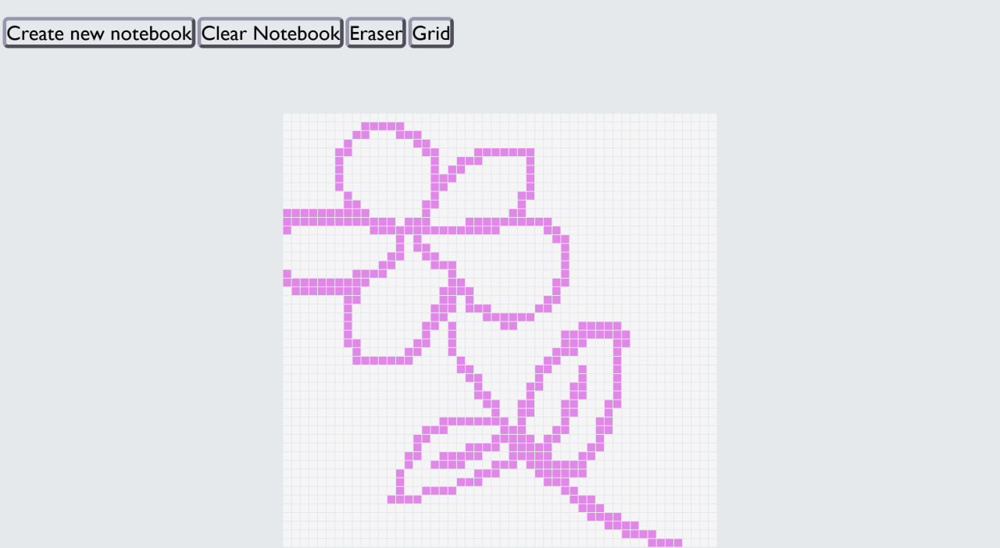

# Etch-a-Sketch

## Table of contents

- [Overview](#overview)
  - [The challenge](#the-challenge)
  - [Screenshot](#screenshot)
  - [Link](#link)
- [My process](#my-process)
  - [Built with](#built-with)
  - [What I learned](#what-i-learned)
  - [Continued development](#continued-development)
  - [Useful resources](#useful-resources)
- [Author](#author)

## Overview

### The challenge

Users should be able to:

- Generate a dynamic drawing grid by entering a custom size (between 2 and 100) via the "Create new notebook" button,
- Draw on the grid by hovering over the squares, which instantly changes their background color,
- Toggle the visibility of the grid lines on and off using the "Grid" button,
- Clear the entire sketchpad without changing the current grid size using the "Clear Notebook" button,
- Toggle an "Eraser" mode to remove colors from specific squares.

### Screenshot

 

### Link

- Live Site URL: [https://tiaranella.github.io/Etch-a-Sketch/]

## My process

### Built with

- HTML5
- CSS
- Flexbox
- Vanilla JavaScript (ES6+)
- Desktop-first workflow

### What I learned

Here are the main things I focused on and learned while building this project:

- **Dynamic DOM Manipulation:** I learned how to dynamically generate a grid of `div` elements using JavaScript based on user input. By calculating the total number of pixels and appending them to the container, I created a highly flexible canvas.
- **CSS Variables and JavaScript:** I expanded my knowledge of manipulating CSS custom properties directly from JavaScript. This allowed me to easily adjust the grid layout and borders based on the user's chosen size without writing inline styles for everything.
- **Algorithmic Scaling:** I implemented a custom mathematical scaling function to ensure the grid borders look proportionate regardless of whether the grid is set to 2x2 or 100x100.
- **State Toggles & Event Handling:** I utilized various event listeners, such as mouseover for the drawing functionality and click for the control buttons. I also implemented logic to toggle states, such as hiding and restoring the grid lines.

### Useful resources

- [MDN Web Docs: Document.createElement()](https://developer.mozilla.org/en-US/docs/Web/API/Document/createElement) - This helped me understand how to properly and efficiently generate HTML elements dynamically via JavaScript.
- [MDN Web Docs: CSS Custom Properties](https://developer.mozilla.org/en-US/docs/Web/CSS/Using_CSS_custom_properties) - A great reference for defining variables to keep my CSS DRY and successfully interacting with it using JavaScript.
- [JavaScript Event Listeners](https://developer.mozilla.org/en-US/docs/Web/API/EventTarget/addEventListener) - Essential documentation for making the drawing grid and control buttons fully interactive.

## Author

- GitHub - [tiaranella](https://github.com/tiaranella)
